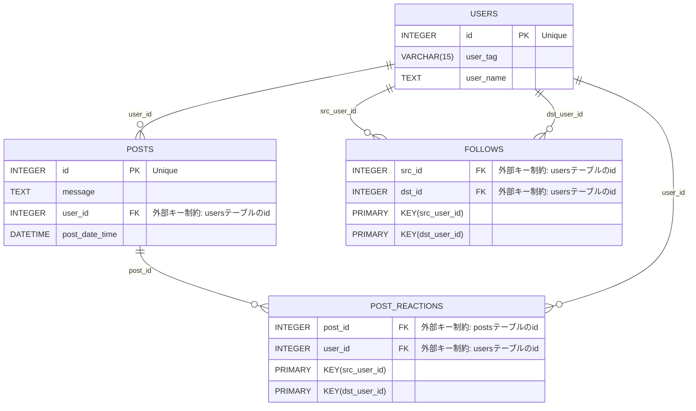

# 簡易SNS
このプラットフォームは[こちら](https://github.com/docomo-KOSAMAX/FAVE/tree/master)を参考に作成したものです。

## フロントエンド
- React(TypeScript)
- Material UI

## バックエンド
- Python: FastAPI
- MySQL: データベース

### 使用方法
- backendフォルダにcongig.pyを作成し、user, password, host, databaseの情報を追加します。
- MYSQLで以下のテーブルを作成します。

### ER図

    

